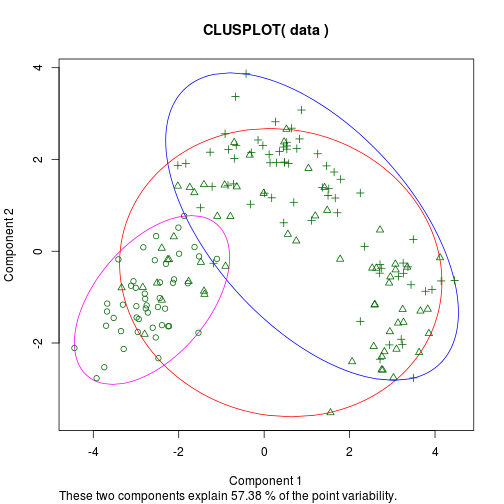
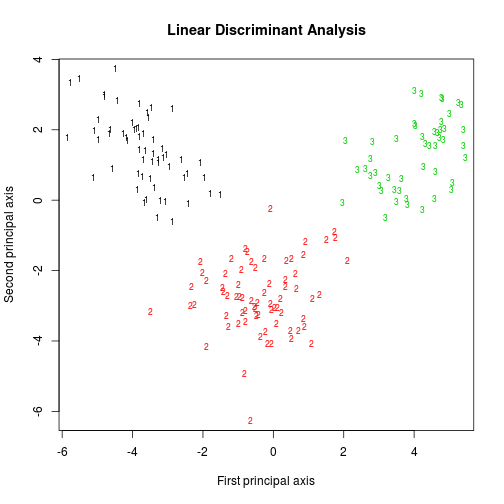

UCI Wine Dataset Analysis
========================================================
author: Jaume Ferrarons
date: February 4th, 2016

Introduction
========================================================

We provide a basic visor of the Wine Data Set from the UCI Machine Learning Reposity. It features 3 classical algorithms:

- K-means
- Linear Discriminant Analysis
- Hierarchical clustering


K-means
========================================================

The figure below shows us that K-means is not able to discriminate the different kinds of wine properly:


```
   X2
X1   1  2  3
  1 46 13  0
  2  1 20 50
  3  0 29 19
```


Hierarchical clustering
========================================================

Hierarchical clustering performs better than K-means. The confussion matrix obtained when cutting the dendrogram in three different grups is the following:

```
   groups
V1   1  2  3
  1 53  6  0
  2  4 16 51
  3  5 22 21
```
And it has an accuracy of:

```
[1] "50.561797752809%"
```

Linear Discriminant Analysis
========================================================

It is the algorithm that has the highest performance. It projects the points into a space such that the classes become clearly separable and it has an accuracy of:

```
[1] "100%"
```
***

***
